# 까까

> 친구의 League of Legends 경기를 함께 보고, 실시간 채팅·승패 예측·도감으로 관계를 이어가는 웹·PWA·Electron 서비스

<p align="center">
  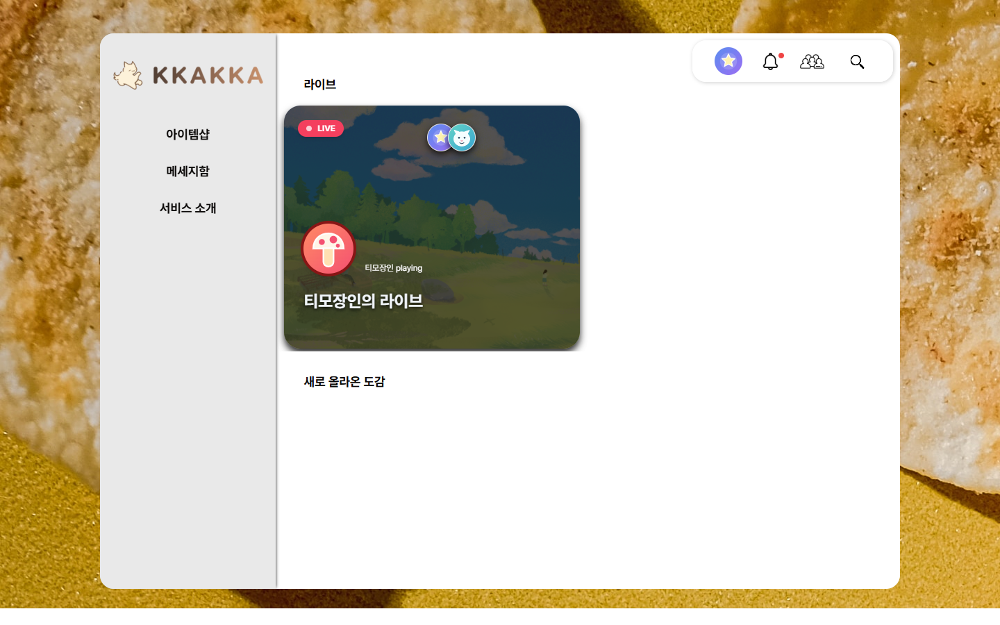
</p>

---

## 01. 프로젝트 개요

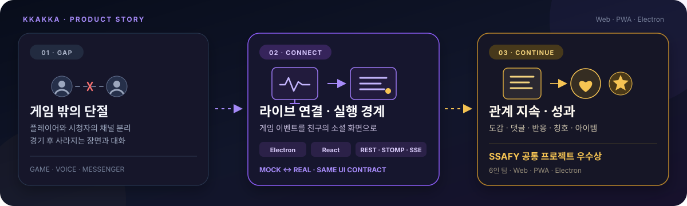

### 해결하려는 문제와 서비스

- **문제**: 게임·음성 채널·메신저로 분리된 플레이어와 시청자, 경기 후 사라지는 장면과 대화
- **라이브 연결**: Electron 게임 상태 감지와 React 소셜 화면을 결합한 친구 중심 라이브 방
- **경기 중**: 게임 이벤트·실시간 채팅·포인트 기반 승패 예측
- **경기 후**: 도감·댓글·반응·칭호·아이템으로 장면과 관계 유지
- **Mock / Real**: 외부 의존성 없는 재현 환경 / 2024년 Spring Boot·Kakao OAuth·League Client 연동 경계

### 프로젝트 정보

| 구분 | 내용 |
| --- | --- |
| 개발 기간 | 2024.01.03 ~ 2024.02.16 |
| 팀 규모 | 6명 |
| 제공 형태 | Web · PWA · Electron |
| 수상·성과 | 삼성청년SW아카데미 2학기 공통 프로젝트 우수상 · 구미 1반 2등 |

<p align="center">
  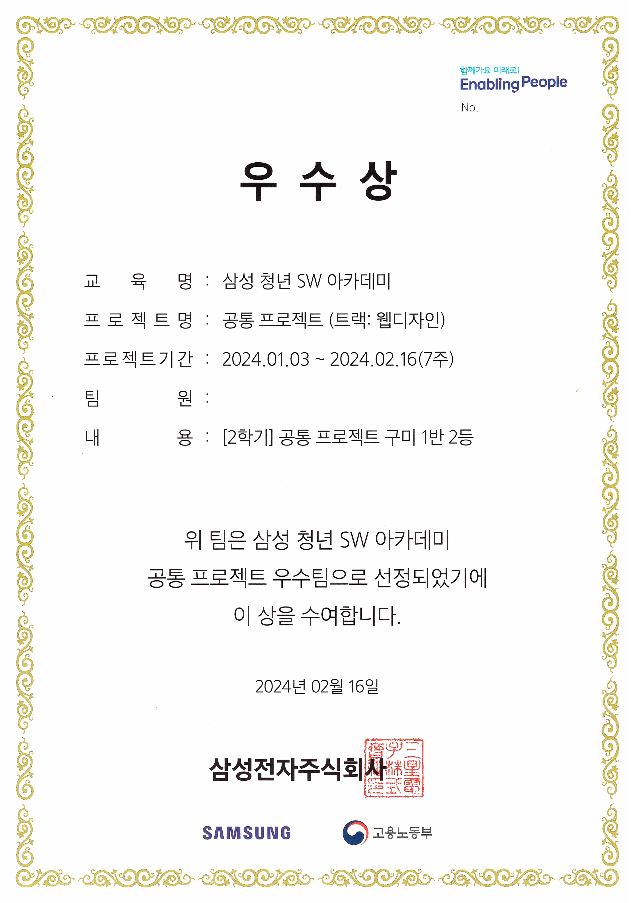
</p>

---

## 02. 팀과 기여

### 팀 구성과 담당 역할

<table width="100%">
  <tr>
    <td width="120" align="center" valign="middle">
      <a href="https://github.com/osy9536"><br /><strong>osy9536</strong></a>
    </td>
    <td valign="middle">
      <strong>팀장 · Backend Lead</strong><br />
      <sub><strong>설계</strong> — 사용자 흐름·공통 응답·예외 규격</sub><br />
      <sub><strong>인증</strong> — Spring Security·JWT 인증 필터·Kakao OAuth</sub><br />
      <sub><strong>API</strong> — 사용자·도감·Frontend 연계 API</sub><br />
      <sub><strong>인프라</strong> — AWS RDS·EC2, Nginx, Jenkins, Docker</sub><br />
    </td>
  </tr>
  <tr>
    <td width="120" align="center" valign="middle">
      <a href="https://github.com/dalcheonroadhead"><br /><strong>dalcheonroadhead</strong></a>
    </td>
    <td valign="middle">
      <strong>Backend</strong><br />
      <sub><strong>채팅</strong> — WebSocket 실시간 채팅 서버</sub><br />
      <sub><strong>게임</strong> — 승패 예측·포인트 정산·League API 명세</sub><br />
      <sub><strong>데이터</strong> — League Local API 수집·S3 이미지 업로드</sub><br />
    </td>
  </tr>
  <tr>
    <td width="120" align="center" valign="middle">
      <a href="https://github.com/oistmil"><br /><strong>oistmil</strong></a>
    </td>
    <td valign="middle">
      <strong>PM · Backend</strong><br />
      <sub><strong>실시간</strong> — SSE 알림·확성기·Frontend EventSource 연계</sub><br />
      <sub><strong>API</strong> — 아이템 구매·칭호·친구 API</sub><br />
      <sub><strong>테스트</strong> — JUnit 서비스 단위 테스트</sub><br />
    </td>
  </tr>
  <tr>
    <td width="120" align="center" valign="middle">
      <a href="https://github.com/andongmin94"><br /><strong>andongmin94</strong></a>
    </td>
    <td valign="middle">
      <strong>Frontend Lead · Electron</strong><br />
      <sub><strong>플랫폼</strong> — Electron·PWA 포팅·공통 React Renderer·데스크톱 셸</sub><br />
      <sub><strong>연동</strong> — League Client·라이브 채팅·Mock·Real 전송·실시간 Gateway</sub><br />
      <sub><strong>보안</strong> — preload·IPC 권한 경계</sub><br />
      <sub><strong>품질</strong> — 게임 이벤트 생명주기·회귀 검증</sub><br />
      <sub><strong>협업</strong> — 선행 기술 연구·UCC 제작</sub><br />
    </td>
  </tr>
  <tr>
    <td width="120" align="center" valign="middle">
      <a href="https://github.com/jiyeon2536"><br /><strong>jiyeon2536</strong></a>
    </td>
    <td valign="middle">
      <strong>서기 · Frontend</strong><br />
      <sub><strong>협업</strong> — Notion 문서·회의록</sub><br />
      <sub><strong>디자인</strong> — Figma 와이어프레임·UI·UX 개선</sub><br />
      <sub><strong>화면</strong> — Kakao 로그인·도감·댓글 CRUD</sub><br />
      <sub><strong>데이터</strong> — React Query 무한 스크롤·Google Analytics</sub><br />
    </td>
  </tr>
  <tr>
    <td width="120" align="center" valign="middle">
      <a href="https://github.com/lhgeer2617"><br /><strong>lhgeer2617</strong></a>
    </td>
    <td valign="middle">
      <strong>총무 · Frontend</strong><br />
      <sub><strong>채팅</strong> — WebSocket UI·실시간 메시지 연동</sub><br />
      <sub><strong>웹</strong> — 웹 UI·UX</sub><br />
      <sub><strong>모바일</strong> — PWA 반응형 UI</sub><br />
    </td>
  </tr>
</table>

### 담당 영역 및 구체적인 기여

#### 구현 소유 경계

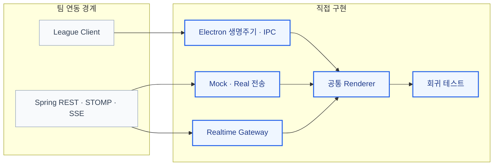

> 파란색: 직접 구현 · 회색: 팀 연동 경계

#### 핵심 구현

- **데스크톱 셸**: BrowserWindow·트레이·프레임리스 창·커스텀 타이틀바 기반 제품 흐름
- **게임 연동**: Gameflow·Live Client Data의 시작·종료·처치·오브젝트 감지와 사용자 메시지 변환
- **공통 Renderer**: 브라우저·PWA·Electron 공유 화면, 상대 경로 빌드, Windows 설치 패키징
- **권한 경계**: preload bridge·IPC 분리, 창 제어·런타임·게임 이벤트·알림 API allowlist
- **실행 모드**: `bootstrap → mode → transport`, 컴포넌트 변경 없는 Mock·Real 공급자 교체
- **서버 없는 데이터**: 사용자·친구·라이브·채팅·예측·도감·아이템 seed, versioned localStorage repository, Axios adapter
- **실시간 추상화**: 실제 STOMP·SSE와 Mock event를 같은 UI 계약으로 연결하는 chat·notification gateway
- **Electron 생명주기**: 샘플 타임라인·League 연결, start/stop, polling·구독·timer 일괄 해제
- **데스크톱 보안**: `contextIsolation`, sandbox, Node integration 비활성화, 외부 navigation 제한
- **회귀 검증**: Mock REST 계약, 저장·복구, 방 단위 채팅 구독의 Vitest 자동화

---

## 03. 사용자 경험

### 대표 화면

| 라이브 중계와 승패 예측 | 프로필과 도감 |
| --- | --- |
| 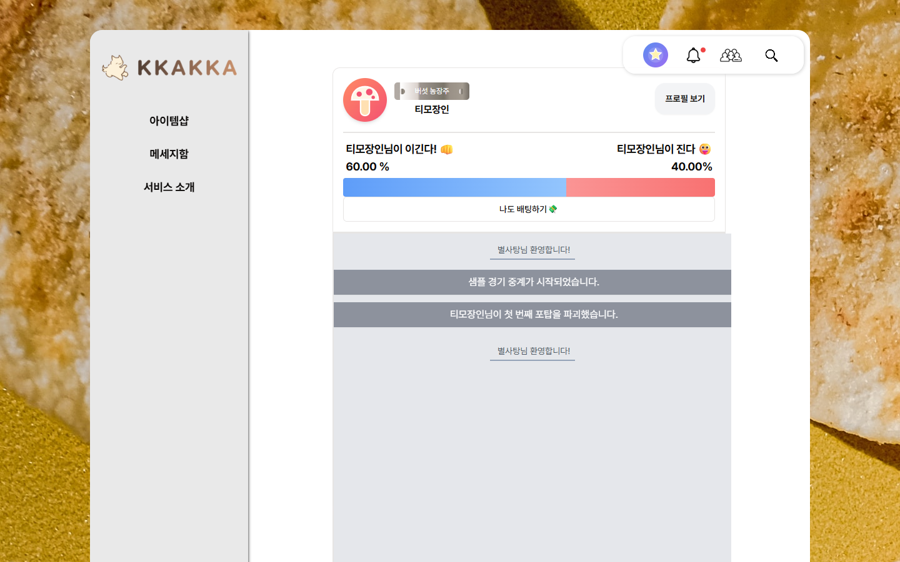 | 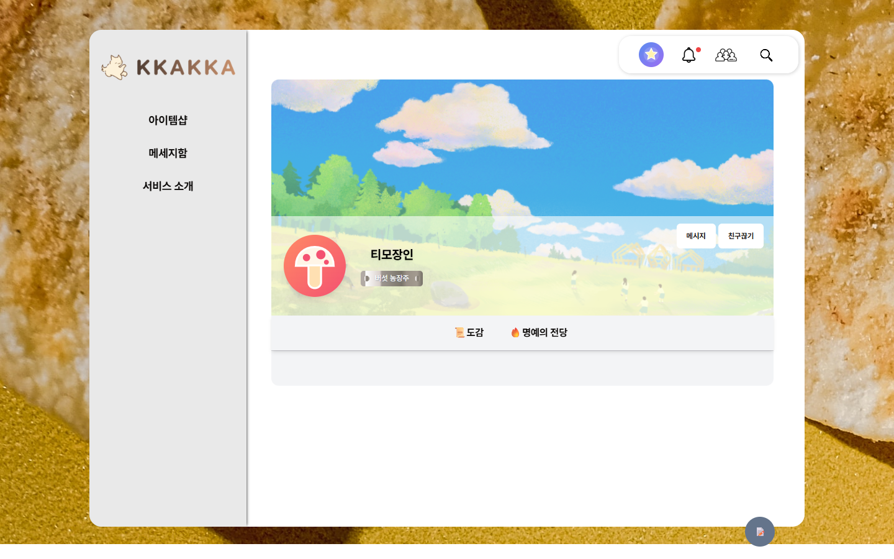 |
| 게임 이벤트·실시간 채팅·승패 예측 | 도감·칭호·친구 관계·댓글·반응 관리 |

| 아이템샵 | 알림과 메시지 |
| --- | --- |
| 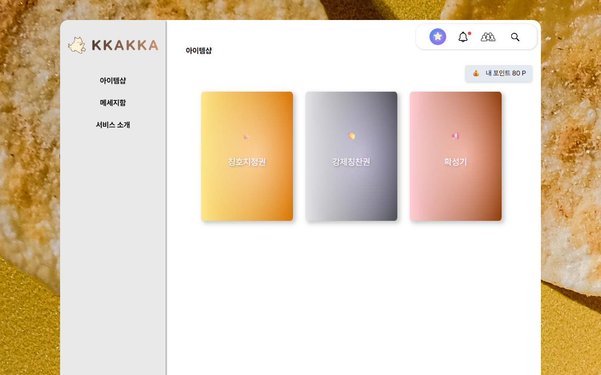 |  |
| 포인트 기반 칭호 지정권·강제 칭찬권·확성기 구매·사용 | 친구 요청·도감·댓글 알림과 1:1 메시지 진입 |

### 핵심 사용자 흐름

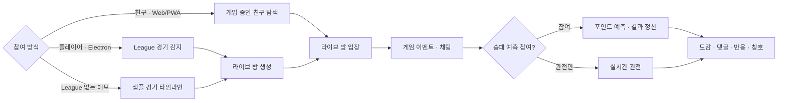

1. League Client Gameflow의 경기 시작 감지 또는 Mock 타임라인 시작
2. 게임 중인 친구의 라이브 방 생성과 웹·PWA 사용자 입장
3. Electron 경기 이벤트 전달, 서버 봇 메시지·실시간 채팅 표시
4. 보유 포인트 기반 승리·패배 예측과 실시간 비율 확인
5. 경기 종료 결과 기반 참여자 포인트 정산
6. 장면의 도감 기록과 댓글·반응·칭호 공유

- **Mock 모드**: 같은 화면·API 함수 유지, 네트워크 요청 경계에서만 공급자 교체, versioned localStorage에 샘플 상태 저장

### 주요 기능

| 기능 | 사용자 경험 | 구현·데이터 흐름 |
| --- | --- | --- |
| 라이브 탐색 | 게임 중인 친구와 참여자 확인, 라이브 방 입장 | React Query·REST, ChatRoom 도메인 |
| 경기 이벤트 | 시작·처치·오브젝트·종료를 읽을 수 있는 메시지로 변환 | Electron, League Gameflow·Live Client Data, IPC |
| 실시간 채팅 | 일반·이미지·시스템/봇 메시지를 같은 방에 중계 | SockJS·STOMP, Mock chat gateway |
| 승패 예측 | 포인트 기반 승패 분포 확인과 결과 정산 | Betting API, MySQL 포인트·예측 상태 |
| 프로필·친구 | 프로필·칭호 확인, 친구 요청·수락·해제 | User·FriendList·Alias 도메인 |
| 도감 | 이미지·설명 등록, 댓글·반응으로 장면 공유 | Dogam 도메인, S3 이미지 저장 |
| 아이템샵 | 칭호 지정권·강제 칭찬권·확성기 구매·사용 | ItemShop·ItemDeal 도메인 |
| 알림·메시지 | 친구 요청·댓글·칭호 알림과 1:1 메시지 확인 | SSE, STOMP, Notification 도메인 |
| 서버 없는 데모 | 로그인·외부 인프라 없이 주요 상태 변화 반복 확인 | Axios adapter, seed, localStorage repository |

---

## 04. 설계와 구현

### 전체 시스템 구조

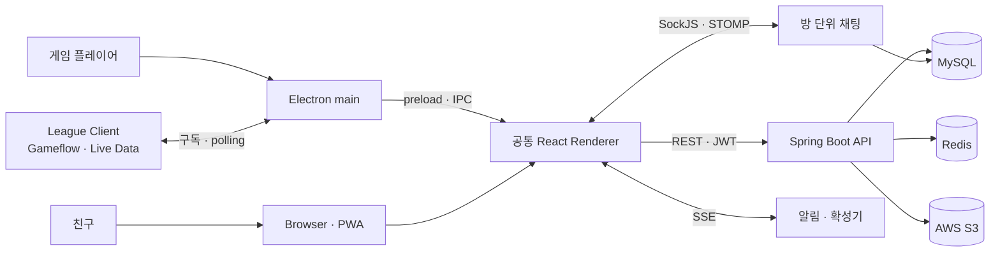

- **Client**: 브라우저·PWA·Electron이 공유하는 React Renderer
- **API·Data**: Spring Boot 도메인 API, MySQL·Redis 상태, S3 이미지
- **Realtime**: 방 단위 양방향 STOMP 채팅 / 단방향 SSE 알림·확성기

<details>
<summary>데이터 모델 보기</summary>

- 사용자·친구 관계·도감·반응·채팅방·메시지·알림·칭호·아이템 거래 내역

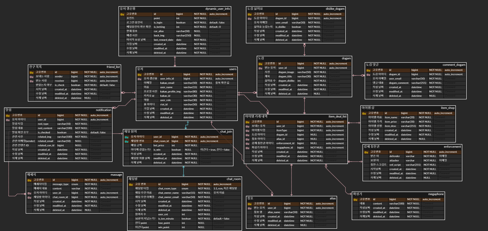

</details>

### 핵심 기술 구현

#### 1. 화면을 바꾸지 않는 Mock·Real 전송 경계

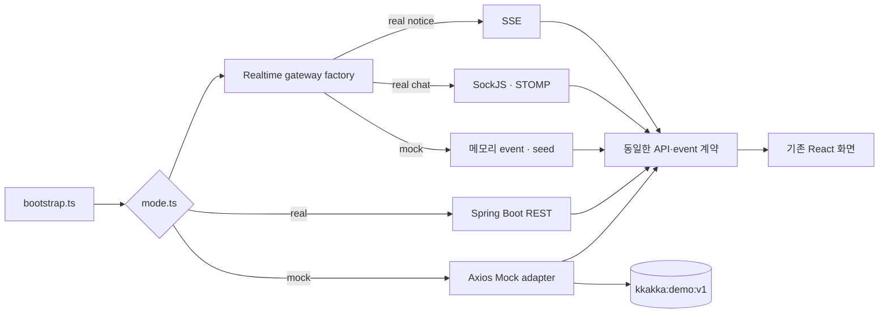

- 화면 import 전 `bootstrap.ts`에서 실행 모드 결정과 Axios transport 구성
- `VITE_APP_MODE=real`만 실제 서버, 나머지는 Mock으로 수렴
- URL·method·payload를 해석해 실제 API 응답 형태를 유지하는 Mock adapter
- `kkakka:demo:v1` 저장, 누락·손상·schema 불일치 시 seed 복구

```text
index.html
  └─ bootstrap.ts
      ├─ mode.ts                   # mock | real 결정
      ├─ configureTransport.ts     # Axios 경계 1회 구성
      └─ main.tsx                  # 기존 React 화면 시작
```

#### 2. Electron 게임 이벤트 생명주기

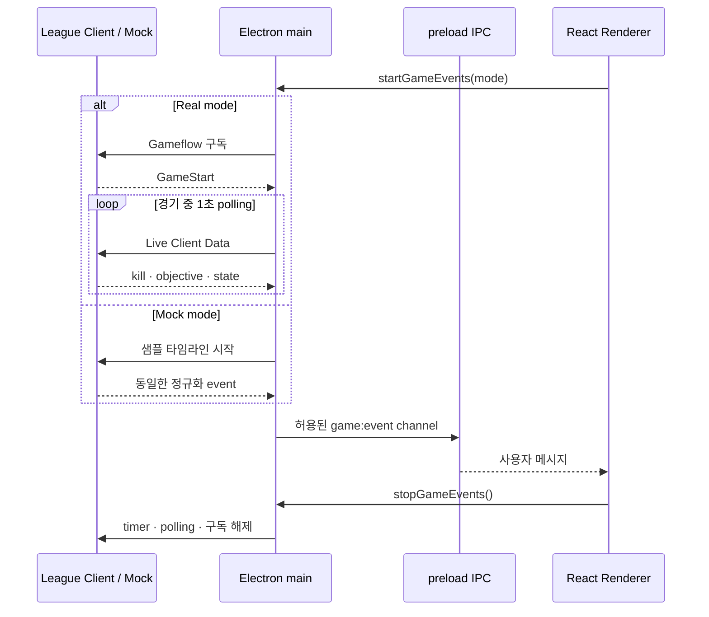

- 단일 `startGameEvents`·`stopGameEvents` 진입점
- **Mock**: 고정 timer의 시작·처치·오브젝트·종료 타임라인
- **Real**: `league-connect` Gameflow 구독과 경기 중 Live Client Data 1초 polling
- **정리**: 새 경기·앱 종료 시 timer·구독·연결 일괄 해제, 중복 listener 방지

#### 3. 최소 권한의 데스크톱 경계

- Renderer의 Node API 직접 접근 차단
- preload에 창 제어·runtime·게임 이벤트·OS 알림만 노출
- `contextIsolation: true`, `nodeIntegration: false`, `sandbox: true`
- 신뢰하지 않는 navigation 차단, HTTP(S) 외부 링크는 시스템 브라우저로 위임

#### 4. 목적에 맞게 나눈 실시간 통신

- **STOMP/SockJS**: 사용자 발행·방 단위 구독이 필요한 양방향 채팅
- **SSE**: 친구 요청·댓글·칭호·확성기의 서버발 단방향 event
- **Gateway**: UI의 `createChatClient`·`createNotificationStream` 호출과 실행 모드별 구현체 선택

### 기술적 의사결정과 해결한 문제

| 문제 | 선택한 방식 | 결과와 고려사항 |
| --- | --- | --- |
| 브라우저·모바일·데스크톱 화면 분리 위험 | 하나의 React Renderer를 웹·PWA·Electron에서 공유 | 화면·상태 로직 중복 축소, 동일 사용자 흐름 |
| 과거 서버와 개인정보 없이 재현하기 어려움 | Mock 기본값, API 요청 경계의 adapter 교체 | 외부 계정·DB·게임 설치 없이 주요 기능 실행 |
| 데모 조건문이 화면 전체로 퍼질 위험 | bootstrap transport 선구성, gateway factory | 컴포넌트·API 계약 유지, 공급자만 교체 |
| Electron `file://`의 route·asset 경로 차이 | Hash Router와 Vite 상대 base | 개발 서버·설치 앱의 동일 route·asset 구조 |
| League Client 없는 Electron 흐름 확인 | Gameflow와 샘플 타임라인을 같은 IPC event로 정규화 | 데스크톱 생명주기·UI 상시 재현 |
| Renderer 침해의 OS 권한 확장 위험 | sandbox·context isolation·preload allowlist | Node/IPC 전체 노출 방지, 권한 표면 축소 |
| 채팅과 알림의 통신 성격 차이 | 채팅 STOMP, 알림·확성기 SSE | 양방향 방 메시지·단방향 event 분리 |
| 새로고침 시 데모 상태 초기화 | versioned localStorage repository와 reset | 포인트·예측·도감·아이템 변화 연속 확인 |

### 기술 스택

| 구분 | 기술 |
| --- | --- |
| Frontend | React 18, TypeScript, Vite 8, React Router 6 |
| 상태·데이터 | TanStack React Query 5, Zustand 4, Axios 1 |
| UI | Tailwind CSS 3, Radix UI, shadcn/ui, Recharts |
| Web App | PWA, Service Worker, 반응형 레이아웃 |
| Desktop | Electron 43, electron-builder, league-connect |
| 실시간 통신 | WebSocket, STOMP, SockJS, SSE |
| Backend | Java 17, Spring Boot 3.0, Spring Security, Spring Data JPA |
| Data·Storage | MySQL 8, Redis 7, AWS S3 |
| 인증 | Kakao OAuth, JWT |
| Infra | Docker, 과거 운영 기준 AWS EC2·RDS, Nginx, Jenkins |
| Test | Vitest, JUnit 5, Mockito |

### 주요 코드 탐색 가이드

| 살펴볼 영역 | 핵심 파일 | 확인할 내용 |
| --- | --- | --- |
| Renderer 초기화 | [`bootstrap.ts`](frontend/src/bootstrap.ts)<br>[`mode.ts`](frontend/src/runtime/mode.ts)<br>[`configureTransport.ts`](frontend/src/api/configureTransport.ts) | 화면보다 먼저 Mock·Real 전송 계층을 구성하는 순서 |
| 서버 없는 데이터 계층 | [`axiosAdapter.ts`](frontend/src/api/mock/axiosAdapter.ts)<br>[`demoRepository.ts`](frontend/src/api/mock/demoRepository.ts)<br>[`seed.ts`](frontend/src/api/mock/seed.ts) | 실제 API 형태 응답, 상태 저장·복구, 가상 데이터 |
| Electron 제품 화면 | [`TitleBar.tsx`](frontend/src/electron/TitleBar.tsx)<br>[`SettingPage.tsx`](frontend/src/electron/SettingPage.tsx) | 프레임리스 창 제어와 게임 이벤트 실행 UI |
| Electron 생명주기 | [`main.js`](frontend/src/electron/main.js)<br>[`preload.cjs`](frontend/src/electron/preload.cjs) | Mock·League event start/stop, BrowserWindow 보안, IPC allowlist |
| 실시간 추상화 | [`chatGateway.ts`](frontend/src/realtime/chatGateway.ts)<br>[`notificationGateway.ts`](frontend/src/realtime/notificationGateway.ts) | STOMP·SSE의 Mock·Real 구현 선택 |
| 라이브 사용자 경험 | [`LiveChat.tsx`](frontend/src/routes/LiveChat.tsx)<br>[`Message.tsx`](frontend/src/components/message/Message.tsx) | 방 연결, 메시지 수신, 이전 메시지, 예측과 메시지 표현 |
| Frontend API 상태 | [`hooks`](frontend/src/hooks)<br>[`services`](frontend/src/services)<br>[`store`](frontend/src/store) | React Query 요청·변이와 Zustand 공유 상태 |
| 인증·보안 | [`WebSecurityConfig.java`](backend/src/main/java/org/ssafy/ssafy_common2/_common/config/WebSecurityConfig.java)<br>[`JwtAuthFilter.java`](backend/src/main/java/org/ssafy/ssafy_common2/_common/jwt/JwtAuthFilter.java)<br>[`UserController.java`](backend/src/main/java/org/ssafy/ssafy_common2/user/controller/UserController.java) | Kakao callback, JWT filter, CORS·인가 경계 |
| 채팅 서버 | [`SpringConfig.java`](backend/src/main/java/org/ssafy/ssafy_common2/chatting/config/SpringConfig.java)<br>[`ChatController.java`](backend/src/main/java/org/ssafy/ssafy_common2/chatting/controller/ChatController.java) | STOMP endpoint, pub/sub destination, 메시지 저장·중계 |
| 도메인 서버 | [`user`](backend/src/main/java/org/ssafy/ssafy_common2/user)<br>[`dogam`](backend/src/main/java/org/ssafy/ssafy_common2/dogam)<br>[`itemshop`](backend/src/main/java/org/ssafy/ssafy_common2/itemshop)<br>[`notification`](backend/src/main/java/org/ssafy/ssafy_common2/notification) | Controller·Service·Repository·Entity 계층 |
| 데모 회귀 테스트 | [`axiosAdapter.test.ts`](frontend/src/api/mock/axiosAdapter.test.ts)<br>[`demoRepository.test.ts`](frontend/src/api/mock/demoRepository.test.ts) | 주요 API 응답과 저장·복구·채팅 구독 계약 |

---

## 05. 실행과 검증

### 실행 방법

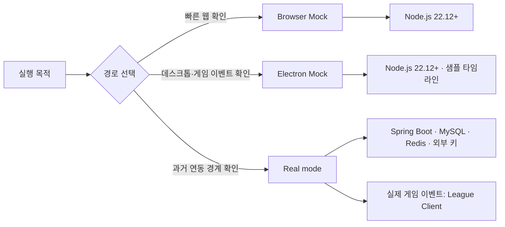

- **요구 환경**: Node.js 22.12 이상
- **기본 실행**: 외부 서버가 필요 없는 Mock 모드

#### 브라우저 데모

```bash
cd frontend
npm ci
npm run dev
```

- **접속**: `http://localhost:3000`
- **데이터**: 가상 사용자·샘플 경기, 설정 화면의 `가상 데이터 초기화`

#### Electron 데모

```bash
cd frontend
npm ci
npm run electron:dev
```

- **기본 이벤트**: 설정 화면에서 시작하는 샘플 경기 타임라인

<details>
<summary>Real 모드와 환경 변수 설정</summary>

#### Frontend

- `frontend/.env.example` 기준의 로컬 전용 환경값

| 환경 변수 | 용도 | 필수 시점 |
| --- | --- | --- |
| `VITE_APP_MODE` | `mock` 또는 `real` 선택 | Real 연결 시 `real` |
| `VITE_API_BASE_URL` | Spring Boot API base URL | Real 연결 시 |
| `VITE_API_BASE_NEXT_URL` | Kakao callback의 서버 token 교환 경로 | Kakao 로그인 시 |
| `VITE_KAKAO_REST_API_KEY` | Kakao REST API 앱 키 | Kakao 로그인 시 |
| `VITE_KAKAO_REDIRECT_URI` | Frontend OAuth callback URI | Kakao 로그인 시 |
| `VITE_GA_KEY` | 선택적 GA4 측정 ID | 분석 event 사용 시 |

```bash
cd frontend
npm run dev:real
```

- **League 연결**: 프로세스 환경의 `KKAKKA_APP_MODE=real`
- **개발 서버 변경**: `KKAKKA_DEV_SERVER_URL`

#### Backend와 로컬 데이터 서비스

- **요구 환경**: Java 17·Docker
- **Compose 범위**: MySQL·Redis

```powershell
docker compose up -d mysql redis
Copy-Item backend/src/main/resources/application-example.yml backend/src/main/resources/application-local.yml
Set-Location backend
.\gradlew.bat bootRun --args="--spring.profiles.active=local"
```

| 환경 변수 | 용도 |
| --- | --- |
| `DB_URL`, `DB_USERNAME`, `DB_PASSWORD` | MySQL 연결 |
| `REDIS_HOST`, `REDIS_PORT`, `REDIS_PASSWORD` | Redis 연결 |
| `JWT_SECRET_BASE64` | JWT HS256 서명 키 |
| `KAKAO_CLIENT_ID`, `KAKAO_CLIENT_SECRET` | Kakao OAuth 앱 정보 |
| `KAKAO_LOCAL_REDIRECT_URI`, `KAKAO_WEB_REDIRECT_URI` | OAuth 완료 후 이동 경로 |
| `AWS_ACCESS_KEY_ID`, `AWS_SECRET_ACCESS_KEY` | AWS SDK 자격 증명 체인 |
| `AWS_REGION`, `AWS_S3_BUCKET` | 이미지 저장 리전·버킷 |
| `CORS_ALLOWED_ORIGINS` | 허용할 Frontend origin 목록 |
| `SERVER_PORT` | Spring Boot 포트 |
| `SAMPLE_FRIEND_EMAIL`, `DEFAULT_BACKGROUND_URL` | 신규 사용자용 기준 데이터 |
| `WEBSOCKET_MAX_MESSAGE_SIZE` | STOMP transport 메시지 크기 제한 |

- **비밀값**: 실제 키·비밀번호의 저장소 기록 금지
- **OAuth 기준 데이터**: 테스트용 기본 아이템과 `SAMPLE_FRIEND_EMAIL`의 가상 사용자

</details>

### 검증 방법

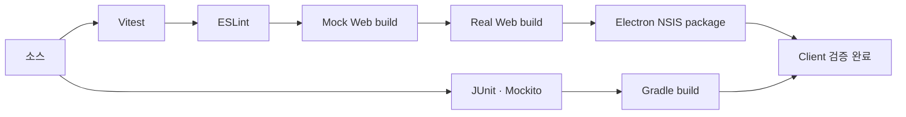

<details>
<summary>검증 명령과 확인 범위</summary>

#### Frontend·Electron

```bash
cd frontend
npm test
npm run lint
npm run build:demo
npm run build:real
npm run app:build
```

| 명령 | 확인 범위 |
| --- | --- |
| `npm test` | Mock adapter REST 계약, localStorage 복구, 방 단위 채팅 구독 |
| `npm run lint` | TypeScript·React Hook·ESLint 규칙 |
| `npm run build:demo` | 서버 없는 PWA production build |
| `npm run build:real` | 실제 API용 production build |
| `npm run app:build` | Electron Renderer build와 Windows NSIS 패키징 |

#### Backend

- Java 17 환경

```powershell
Set-Location backend
.\gradlew.bat test
.\gradlew.bat build
```

- **포함**: 사용자·친구·도감·댓글·반응·알림·아이템 서비스의 JUnit 5·Mockito 단위 테스트
- **제외**: OAuth·S3·실시간 통합 환경 전체를 자동 기동하는 E2E

</details>

### 프로젝트 범위와 현재 상태

| 실행 경로 | 즉시 실행 | 추가 설정 | 확인 범위 |
| --- | :---: | --- | --- |
| Browser Mock | ✅ | 없음 | 로그인 세션·메인·라이브·채팅·예측·프로필·도감·아이템샵 |
| Electron Mock | ✅ | 없음 | 공통 화면·데스크톱 셸·샘플 경기 이벤트 |
| Real Frontend·API | △ | Java 17·MySQL·Redis·Kakao·S3 환경값 | 2024년 Spring Boot API 연동 경계 |
| Real League event | △ | 실행 중인 League Client | Gameflow 구독·Live Client Data polling |
| 과거 운영 데이터 | — | 운영 자격증명·DB dump 미포함 | 코드와 데이터 모델만 보존 |

- **데모 데이터**: 가상 사용자·친구·라이브 방·도감·포인트, 브라우저 localStorage에 상태 유지
- **검증 범위**: Mock API 테스트, ESLint, Mock·Real Vite build, Electron Windows package, Backend 단위 test·build
- **보존 범위**: 2024년 React·Electron·Spring Boot 팀 구현과 서버·게임 설치 없는 Mock 실행 환경
- **탐색 경계**: 본인의 Electron·게임 이벤트·실행 모드 / 팀의 실시간 소셜 기능
